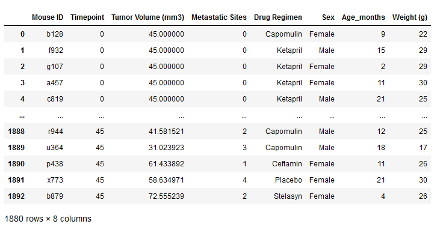
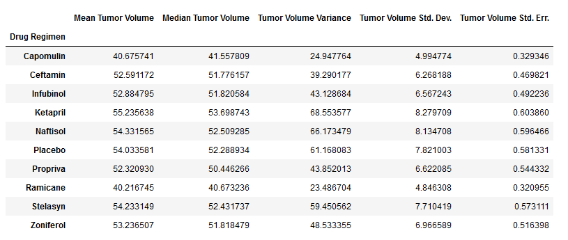
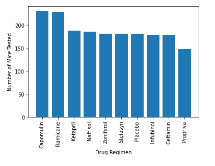
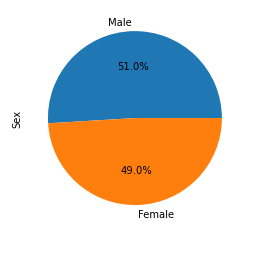
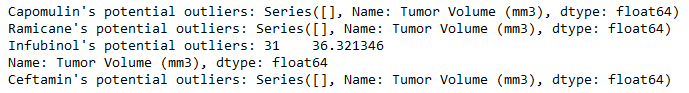
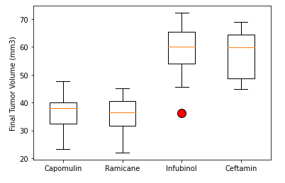
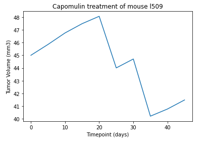
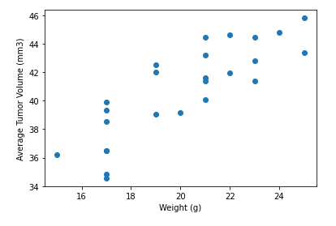
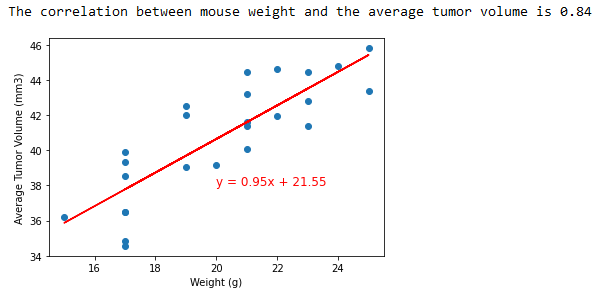

# Analyzing Anti-Cancer Medications in Mice using Jupyter Notebook, Pandas, & Matplotlib

## Resources
Data Source: Mouse_metadata.csv, Study_results.csv

Software: Python 3.9.7; Jupyter Notebook 6.4.11; Pandas 1.3.5; Matplotlib 3.5.1

## Project Overview
Use the data provided to compare the effectiveness of the drug, Capomulin, against the other treatment regimens when treating squamous cell carcinoma (SCC), a commonly occuring form of skin cancer.

Tasks include:
1. Preparing and cleaning data by merging the two datasets and dropping duplicate mice ID's
2. Generating summary statistics for each drug regimen
3. Creating visualizations such as bar charts, pie charts, line charts, and scatter plots
4. Calculating quartiles, finding outliers, and creating a box plot
5. Calculating correlation and linear regression between the selected drug regimen, Capomulin, and the average tumor volume

## Results & Analysis

- The table above displays the clean dataframe after merging the two datasets and dropping duplicate mice ID's
- There are 248 unique Mouse ID's in the cleaned dataset
- Metastatic Sites ranges from 0-4
- Age ranges from 1-24 months
- Weight ranges from 15-30 grams

- The table above displays the summary statistics for each drug regimen
- Ramicane is the leading drug regimen across all category statistics with the smallest average tumor volume, median tumor volume, tumor volume variance, tumor volume standard deviation, and tumor volume standard error of mean

- The bar chart above displays the number of mice tested for each drug regimen
- The two highest were Capomulin & Ramicane at above 200 mice

- The pie chart above displays the distribution of male versus female mice
- As you can see, it is roughly a 50/50 split

- The image above displays the output of our calculations to determine the outliers for these 4 drug regimen
- As you can see, there is only one outlier for Infubinol, which falls short of the lower bound

- The boxplot above displays the upper and lower bounds and the single outlier we found in our previous calculation for the 4 drug regimen

- The line chart above displays the reduction in tumor volume for mouse "l509" using the drug Capomulin after 40+ days

- The image above displays a scatter plot of average tumor volume vs. mouse weight for the drug Capomulin

- The image above displays the correlation coefficient (0.84) between mouse weight and average tumor volume for the drug Capomulin
- It also includes the linear regression model we calculated to be able to predict the average tumor volume based on the weight of the mouse

## Drawing Insights

- From the line chart we generated, we can see that Capomulin can be an effective drug regimen to treat squamous cell carcinoma (SCC). However, more data needs to be visualized as this was done for only one mouse in the dataset.
- With a correlation coefficient of 0.84, this indicates a strong positive relationship between mouse weight and average tumor volume.
- The regression equation that was calculated allows us to predict the average tumor volume for a given weight of a mouse on the Capomulin regminen. However, it's important to keep in mind that the relationship between mouse weight and tumor volume may not be the same for all mice or all treatments, and the regression equation should be used with caution and validated with additional data.
